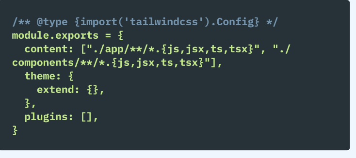
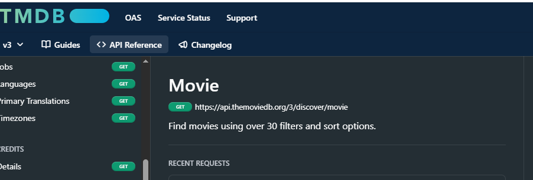

[YouTube Tutorial](https://www.youtube.com/watch?v=f8Z9JyB2EIE)

#### Expo is to react-native what Next.js and Vite is to React
1.  Improved cli over the react-native cli
2. <b>Over air updates:</b>
   - users can get latest code without needing App store approval
3. Differences 

  

4. NativeWind allows you to write Tailwind like CSS styles in react native.
5. <View is like <Div <p <h with added functionality.
   - Uses flexbox layout by default
6. <TouchableOpacity for creating simple buttons
7. onPress instead of onClick
8. <TouchableHighlight
9. <TouchableWithoutFeedback
10. <ActivityIndicator
11. <FlatList
    - For rendering long list of items that need to be scrolled.  Like map in React with extra features which already accepts some props. such as "data" props for an array of data to map, and a "renderItem" prop
  

12. <ScrollView
13. <SafeAreaView
    
    -A safe zone to render app content within, with out it being covered by the  device hardware feature. e.g Status bar
14. <Image and <ImageBackground
    - SVG not supported
    - need a 3rd party package react-native-svg

15. <Modal 
16. <Alert 
17. <Switch for toggles 
18. <StatusBar from Expo is preferred

## Native Wind Installation.

[Follow the steps from Native Wind official 
Installation Guide for Expo](https://www.nativewind.dev/getting-started/installation)

run

        npx expo customize metro.config.js

and override with file in the Install guide

        const { getDefaultConfig } = require("expo/metro-config");
        const { withNativeWind } = require('nativewind/metro');

        const config = getDefaultConfig(__dirname)

        module.exports = withNativeWind(config, { input: './global.css' })

  ## snippet
          rnfes

   ## to restart project an clear cache
          npx expo start --clear

  ## Customize Expo app to show logo of application when it is loading:
   by Fixing "assets not found error" Unable to resolve asset "./assets/images/icon.png" from "icon" in your app.json or app.config.js
  
  ### edit app.json:
   from: "icon": "./assets/images/icon.png",
   to:  "icon": "./assets/images/logo.png",
   for android: 
   change 
        "foregroundImage": "./assets/images/adaptive-icon.png",
        "foregroundImage": "./assets/images/logo.png",
   for web:
          "image": "./assets/images/splash-icon.png",
          "image": "./assets/images/logo.png",
    expo-splash-screen
          "image": "./assets/images/splash-icon.png",
          "image": "./assets/images/logo.png",

## React hooks:
A function that 
1. starts with the word 'use'
2. typically are called at the top of the function component.
3. expose additional functionalities
   - For Example  define a router using the useRouter hook allowing us to move between screens programmatically. Go to another page or screen when something happens. 
