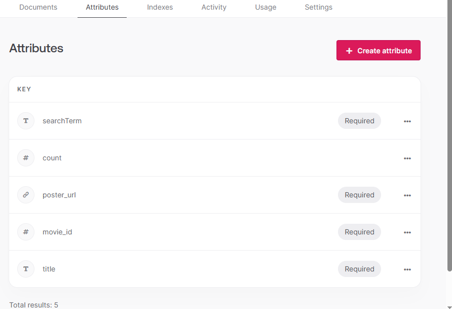

[YouTube Tutorial](https://www.youtube.com/watch?v=f8Z9JyB2EIE)

#### Expo is to react-native what Next.js and Vite is to React

1.  Improved cli over the react-native cli
2.  <b>Over air updates:</b>
    - users can get latest code without needing App store approval
3.  Differences

4. NativeWind allows you to write Tailwind like CSS styles in react native.
5. <View is like 
API References
5. Click "Try it" to see authentication response
6. Search for "discover movie", the endpoint for discovering movies.
   
7. Click "Try it"
   - response shows over 49,000 pages with much detail of almost 1 million movies.

For our code:

1.  Copy the entire fetch request.
2.  Create a new folder/file called 'services/api.ts'
3.  Paste in the copied fetch request as a template. REM it out.
4.  Use the template to create a TMDB config export in conjunction with a .env file.

## Custom Hook

To handle the fetching of data in a clean reusable and scalable way. Without cluttering the component by abstracting away the logic for fetching the data, managing the error and loading state. Also, manually trigger a refetch when needed.

1. Create a useFetch.ts file in the services folder.
2. Create the useFetch function which accepts the Fetch function as a parameter, e.g,:
   - fetchMovies
   - fetchMovieDetails
   - of type function the returns a promise of generic parameter T
   - const userFetch = <T>(fetchFunction: () => Promise<T> ) => {}
  
### React 19 comes with a host of new hooks
Ex: The use() useActionState() useFormState() useTransition() etc
  

## Develop Search Screens
1. autofetch is set to false
fetch the object that represents the movie where query matches the 'user input for the search'

             const {
               data: movies,
               loading,
               error,
            } = useFetch(() => fetchMovies({ query: searchQuery }), false);

2. ListHeaderComponent is a special Flatlist prop that renders an element (react fragment) that contains what is displayed at the top of the list.

3.  (Non-null Assertion): This operator tells TypeScript that you are certain the value is not null or undefined. It effectively overrides TypeScript's type checking for null or undefined values.

            {!loading &&
              !error &&
              searchQuery.trim() &&
              movies?.length! > 0 && (
                <Text className="text-xl text-white font-bold">
                  Search Results for{' '}
                  <Text className="text-accent">{searchQuery}</Text>
                </Text>
              )}

   
   ## Debouncing
   So not to overload the api with every key stroke. Wrap a search term into a timeout function

         useEffect(() => {
            // const func = async () => {
            const timeoutId = setTimeout(async () => {
               if (searchQuery.trim()) {
               await loadMovies(); //* since we are using await, need to wrap the if statement in a async function
               } else {
               reset();
               }
            }, 500);

            // func();
            //* clear the timeout by returning a callback function with that ID
            return () => clearTimeout(timeoutId);
         }, [searchQuery]);
         //* recall the function every time the searchQuery changes.

## Appwrite Setup
## Algorithm that displays trending status of  movies;  i.e. what movies are the app users searching for.
1. The more users are performing a specific search, the higher its trending status become. Requires tracking and analyzing search patterns over time. This requires a database to store searches permanently.
2. Make use as a BaaS (backend as a service). Provides APIs and tools to store and manage data
3. This project uses Appwrite. Simple, openSource, and free to use.

Create a project in Appwrite
place the EXPO_PUBLIC_APPWRITE_PROJECT_ID=#### in the env file
Chose react native, and create a bundle id: com.dvm.movieapp
run this in your bash shell

     npx expo install react-native-appwrite react-native-url-polyfill

click Next, and Next again to skip the optional steps
then "Go to dashboard" to set up the backend.
1. Create a database and collections within it.
   1. call it "movies" => create
   2. You will get a database ID.
   3. EXPO_PUBLIC_APPWRITE_DATABASE_ID=#### goes into .env
2. Create a collection
   1. call it "metrics" => Create
   2. You will get a collection ID 
   3. EXPO_PUBLIC_APPWRITE_COLLECTION_ID=#### goes into .env
3. Now create attributes
   1.  Select the "attribute" tab. => Create attribute => string 
   2.  Attribute Key* searchTerm => 1000 character => required => Create
   3.  integer Attribute Key* count => default 0 =>Create
       1.  This is how many times a user searched for a specific search term
   4. url Attribute Key* poster_url => required =>Create
   5. integer  Attribute Key* movie_id => required =>Create
   6. string  Attribute Key* title => 1000 => required =>Create
   
   

   Permissions:
   1. Go to "Settings" tab
   2. Scroll down to 'Permissions'
   3. Click the plus icon +
   4. select "Any" and grant full CRUD => Update 

   Test Permissions
   1. create a new file services/appwrite.ts

   
   
